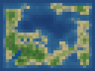

# kitnega

> agenti(k) backwards

A monorepo with stdlib-only packages for different domains:

| Package   | Role                                                                                |
| --------- | ----------------------------------------------------------------------------------- |
| `cody`    | Agentic coding harness — LLM-powered coding agent                                   |
| `duncan`  | TTRPG procedural oracle — dice-driven random generation                             |
| `carly`   | Procedural map generator — diamond-square + Voronoi                                 |
| `merlin`  | Random-split forests (ExtraTrees, IsolationForest, Mondrian) with built-in TreeSHAP |
| `kenneth` | Kneser-Ney language model with NLTK alignment, PyTorch/ONNX export                  |
| `klaus`   | Minimal Slack clone — Bottle + htmx + sqlite3 chat server                           |
| `raleigh` | Static site generator from markdown with front-matter                               |
| `lib`     | Shared utilities — vendored modules used across packages                            |

## cody

A minimal agentic coding harness using only Python stdlib.

```
while not done:
    response = ask_llm(context)
    if response.wants_to_run_tool:
        if human_approves(tool_call):
            result = execute(tool_call)
            context.append(result)
    else:
        print(response)
        done = true
```

### Quick Start

```bash
# Interactive REPL
uv run cody

# One-shot
uv run cody "fix the tests"

# Pipe mode
echo "explain the codebase" | uv run cody

# Continue last session
uv run cody -c

# List sessions
uv run cody -s

# Auto-approve (YOLO mode) — also enables parallel tool execution
# Set "approve_all": true in ~/.kitnega/config.json
```

### Features

- **Zero dependencies** — pure Python stdlib (urllib, subprocess, json)
- **OpenAI-compatible** — works with LM Studio, Ollama, any Responses API
  endpoint
- **SSE streaming** — real-time text output via server-sent events
- **Parallel tool execution** — runs independent tools concurrently in
  auto-approve mode
- **.gitignore-aware** — respects project gitignore rules when searching files
- **Cached context walks** — discovers AGENTS.md/README.md once per session, not
  every turn
- **In-memory session cache** — defers disk writes, avoids redundant I/O
- **Pipe-able** — `echo "prompt" | cody` for scripting
- **Human-in-the-loop** — approve each write/edit/bash call, read-only tools
  skip approval
- **Session persistence** — continue conversations with `-c` or pick with `-s`

### Built-in Tools

| Tool    | Approval    | Description                                 |
| ------- | ----------- | ------------------------------------------- |
| `read`  | ❌ skip     | Read file contents with optional line range |
| `write` | ✅ required | Create or overwrite a file                  |
| `edit`  | ✅ required | Find/replace patch in a file                |
| `bash`  | ✅ required | Run shell commands                          |
| `grep`  | ❌ skip     | Search file contents with regex             |
| `find`  | ❌ skip     | Find files by glob pattern                  |
| `ls`    | ❌ skip     | List directory contents                     |

### REPL Commands

| Command        | Description                 |
| -------------- | --------------------------- |
| `:q` / `:quit` | Exit                        |
| `:reset`       | Reset conversation          |
| `:load`        | List recent sessions        |
| `:load <id>`   | Continue a specific session |

## duncan

A TTRPG procedural oracle — generates NPCs, events, locations, factions, and
encounters via seeded dice and weighted tables. No LLM, no API calls.

See [duncan/README.md](duncan/README.md) for full docs.

```bash
uv run duncan npc
uv run duncan event --seed tavern42
uv run duncan "a shady merchant in a tavern"
```

## carly

A procedural map generator using diamond-square heightmaps and Voronoi terrain
regions. Pure Python stdlib, zero dependencies.

```bash
uv run carly                                    # default 32x24 map
uv run carly --width 64 --height 48 --rivers    # larger map with rivers
uv run carly --seed 8675309 --voronoi-regions 300
uv run carly --enable-voronoi -o mymap.png      # Voronoi normalization
```

Sample output (32×24 tiles, rivers enabled):



## merlin

Random-split forests (ExtraTrees, IsolationForest, Mondrian) with built-in
TreeSHAP. Stdlib + `lib.array` only.

See [merlin/README.md](merlin/README.md) for full docs.

```bash
uv run merlin --help
```

## kenneth

Interpolated Kneser-Ney language model with pure-Python training,
NLTK-compatible scoring, and optional PyTorch/ONNX export.

```python
from kenneth.model import KneserNeyModel

model = KneserNeyModel(order=3)
model.fit([["the", "cat", "sat"], ["the", "dog", "ran"]])
model.score("cat")  # log probability
model.perplexity("the cat sat".split())
```

## klaus

Minimal Slack clone — a chat server with rooms, DMs, and htmx-driven UI. Built
with `lib.bottle` (Bottle web framework from `lib/`), sqlite3, and htmx. Zero JS
framework dependencies — just htmx for partial page swaps.

See [klaus/README.md](klaus/README.md) for full docs.

```bash
uv run klaus init-db          # initialize DB (fails if exists; add --force to reset)
uv run klaus create-admin     # create an admin user
uv run klaus serve             # start the server on http://127.0.0.1:8080
```

## raleigh

A minimal static site generator from markdown with front-matter. Pure Python
stdlib, zero dependencies.

```bash
uv run raleigh                        # build source/ → _site/
uv run raleigh -o docs/_site          # custom output directory
uv run raleigh --title "My Blog"       # override site title
```

Directory layout:

```
source/
  index.md                  Homepage
  posts/2026-05-26-post.md  Blog posts (date in front-matter)
  about/index.md            Sub-pages
  assets/                   Static files (copied verbatim)
```

## Workspace

This repository uses
[uv workspaces](https://docs.astral.sh/uv/concepts/projects/workspaces/).

```bash
uv sync              # install all workspace members
uv run cody <cmd>    # run the coding agent
uv run duncan <cmd>  # run the TTRPG oracle
uv run carly <args>  # run the map generator
uv run merlin <cmd>  # run ML experiments
uv run klaus <cmd>   # run the chat server (serve, init-db, create-admin)
uv run raleigh       # build static site from markdown source
uv run pytest        # run tests
uv run ruff check    # lint
```

## Inspired By

- [pnegahdar/nano](https://github.com/pnegahdar/nano) — minimalist agentic
  coding workflow ideas
- [badlogic/pi-mono](https://github.com/badlogic/pi-mono) — terminal-focused
  agent harness design
