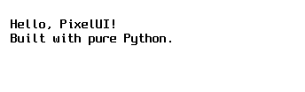
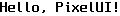
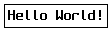
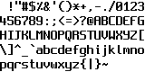
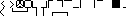

# Pixie

A 1-bit spritesheet renderer for pixel UI elements — text, borders, panels, and
UI icons — backed by an 8×16 pixel font (Spleen) and 8×8 element tiles. Pure
Python, zero dependencies.

```python
from pixelui import Renderer, default_font

font = default_font()
canvas = Renderer(font).render_panel(
    title="PixelUI",
    body="1-bit spritesheet UI.\n\nBuilt with pure Python.",
)
canvas.to_png("output.png")  # → 344×104 px
```



## Quick Start

```bash
# Generate sample outputs
uv run python example.py
# Creates: text_output.png, bordered_box.png, output.png,
#          spritesheet.png, elements_spritesheet.png
```

## API

### Renderer (`pixelui.render.renderer.Renderer`)

The main compositing engine — lays out text and elements onto an RGBA canvas.

```python
from pixelui import Renderer, default_font
from pixelui.render.canvas import BLACK, WHITE

font = default_font()

# Plain text (tight, no padding)
canvas = Renderer(font, padding=0, fg_color=BLACK, bg_color=WHITE).render_text("Hello, PixelUI!")
# → 120×16 px



# Bordered box (tightly wrapped, 8×8 border tiles)
canvas = Renderer(font, padding=0).render_layout(
    layout_bordered_box("Hello World!", font)
)
# → 112×32 px



# Bordered panel with title
canvas = Renderer(font, fg_color=BLACK, bg_color=WHITE).render_panel(
    title="Hello, PixelUI!",
    body="This is a 1-bit\nspritesheet UI.\n\nBuilt with pure Python.",
)
# → 344×104 px

# Using a coloured background per-item
canvas = Renderer(font, padding=0, fg_color=WHITE, bg_color=BLACK).render_bordered_box("test")
```

| Parameter  | Default  | Description                            |
| ---------- | -------- | -------------------------------------- |
| `font`     | required | `SpriteFont` instance                  |
| `padding`  | `4`      | Border padding in pixels               |
| `fg_color` | `BLACK`  | RGBA for mask "on" bits                |
| `bg_color` | `WHITE`  | RGBA for mask "off" bits & canvas fill |

### Canvas (`pixelui.render.canvas.Canvas`)

Raw RGBA pixel buffer with PNG export.

```python
from pixelui import Canvas
from pixelui.render.canvas import BLACK, WHITE

# Create a 64×32 canvas (defaults to white fill)
canvas = Canvas(64, 32)

# Clear to a colour
canvas.clear(WHITE)
canvas.clear((135, 206, 235, 255))  # sky blue

# Get/set individual pixels
canvas.set_pixel(0, 0, BLACK)
pixel = canvas.get_pixel(0, 0)   # → (0, 0, 0, 255)

# Indexed access
canvas[0, 0] = BLACK
pixel = canvas[0, 0]

# Blit from another canvas
canvas.blit(source, src_x, src_y, dst_x, dst_y, width, height)

# Blit a 1-bit mask (1 → fg_color, 0 → bg_color)
canvas.blit_from_bytes(
    data, src_width, src_height,
    src_x, src_y, dst_x, dst_y, width, height,
    fg_color=BLACK, bg_color=WHITE,
)

# Export to PNG
png_bytes = canvas.to_png()         # returns bytes
canvas.to_png("output.png")         # writes to file

# Copy
canvas2 = canvas.copy()
```

### Layout (`pixelui.ui.layout`)

Positioning engine — produces `LayoutResult` objects with positioned
`LayoutLine` items.

```python
from pixelui import default_font
from pixelui.ui.layout import (
    wrap_text, layout_text, layout_panel, layout_bordered_box, LayoutResult,
)

font = default_font()

# Word-wrap text
wrapped = wrap_text("hello world foo bar", 10)
# → ["hello", "world foo", "bar"]

# Layout text with wrapping (each character becomes a LayoutLine)
result = layout_text("hello world", font, max_width_chars=6)
# → width=40, height=32 (glyph_height × 2 lines)
# → 10 layout lines (one per character)

# Multi-line text
result = layout_text("line1\nline2", font)
# → width=40, height=32

# Bordered panel layout
result = layout_panel("Title", "Body text", font=font)
# Bordered box layout (tight, 8×8 border tiles)
result = layout_bordered_box("Hello", font)
# → width=56, height=32 (8 + 8×5 + 8 = 56, 8+16+8 = 32)
# → 20 layout lines

result.width       # total canvas width needed
result.height      # total canvas height needed
result.lines       # list of LayoutLine items
```

### LayoutLine fields

| Field     | Type  | Description                         |
| --------- | ----- | ----------------------------------- |
| `kind`    | `str` | `"text"`, `"element"`, or `"blank"` |
| `content` | `str` | Character or element name           |
| `x`       | `int` | Horizontal pixel position           |
| `y`       | `int` | Vertical pixel position             |

### SpriteFont (`pixelui.fonts.sprite_font.SpriteFont`)

8×16 glyph map with spritesheet packing.

```python
from pixelui import default_font, SpriteFont

font = default_font()
# Spleen 8×16, 20 cols, 95 ASCII printable characters

font.name           # → "pixelui-default-8x16"
font.glyph_width    # → 8
font.glyph_height   # → 16
font.cols           # → 20

glyph = font.get_glyph('A')
glyph.char          # → "A"
glyph.pixels        # → list of 16 bytes (MSB-first)
glyph.width         # → 8
glyph.height        # → 16

# Measure text
font.measure_text("Hi")       # → (16, 16)
font.measure_text("A\nB")     # → (8, 32)

# Spritesheet export
size = font.export_spritesheet("spritesheet.png")
# → size in bytes, writes all glyphs to a 1-bit PNG



# Build raw spritesheet bytes
data, width, height = font.build_spritesheet()
```

### Elements (`pixelui.ui.elements`)

8×8 UI element sprites — borders, shadows, checkboxes, arrows, fill patterns.

```python
from pixelui import get_element, export_element_spritesheet, ELEMENTS

# List all built-in elements
sorted(ELEMENTS.keys())  # see table below

# Look up by name
elem = get_element("arrow-right")
elem.name    # → "arrow-right"
elem.pixels  # → list[8 bytes]
elem.width   # → 8
elem.height  # → 8

# Export all elements to a spritesheet PNG
export_element_spritesheet("elements_spritesheet.png")
# → 8×8 tiles in a 16-column grid
```



| Name                                      | Description                     |
| ----------------------------------------- | ------------------------------- |
| `corner-tl/tr/bl/br`                      | Box-drawing corners             |
| `edge-top/bottom/left/right`              | Box-drawing edges               |
| `table-tl/tr/bl/br`                       | HTML-table-style border corners |
| `table-top/bottom/left/right`             | HTML-table-style border edges   |
| `fill-solid`                              | 8×8 solid fill                  |
| `fill-none`                               | 8×8 empty fill                  |
| `shadow-right`                            | Diagonal shadow right           |
| `shadow-bottom`                           | Horizontal shadow bottom        |
| `arrow-right` / `arrow-left`              | Pointing arrows                 |
| `checkbox-checked` / `checkbox-unchecked` | Checkbox states                 |
| `divider`                                 | Single-pixel horizontal line    |

## Example Output

Running `uv run python example.py` generates these PNGs:

| File                       | Dimensions | Description                                  |
| -------------------------- | ---------- | -------------------------------------------- |
| `text_output.png`          | 120×16     | Plain text, no padding                       |
| `bordered_box.png`         | 112×32     | Tight box border around "Hello World!"       |
| `bordered_box_skyblue.png` | 88×32      | Sky-blue background with white-on-black text |
| `output.png`               | 344×104    | Full panel with title and body text          |
| `spritesheet.png`          | 160×96     | All 95 Spleen 8×16 glyphs in a grid          |
| `elements_spritesheet.png` | 128×64     | All 24 UI element tiles                      |

## Architecture

```
text string
    │
    ▼
layout_text / layout_panel / layout_bordered_box
    │
    ▼
LayoutResult (positioned LayoutLine items)
    │
    ▼
Renderer.render_layout(LayoutResult)
    │
    ▼
Canvas (RGBA pixel buffer) ←── SpriteFont (8×16 glyphs)
    │                           Elements (8×8 tiles)
    ▼
to_png()  ──►  PNG file
```
